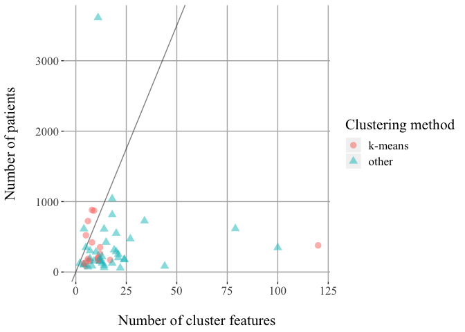

Tables and figures for manuscript
================
Elsie Horne
31/07/2019

Abstract
--------

### Data types

| Data type  | n (%)    |
|:-----------|:---------|
| Mixed      | 47 (75%) |
| Continuous | 12 (19%) |
| Unclear    | 4 (6%)   |

Initial considerations
----------------------

### Identifying candidate cluster features

<table>
<colgroup>
<col width="44%" />
<col width="11%" />
<col width="43%" />
</colgroup>
<thead>
<tr class="header">
<th align="left">Number of methods used by each study</th>
<th align="left">n (%)</th>
<th align="left">Cumulative sum using &gt;z methods (%)</th>
</tr>
</thead>
<tbody>
<tr class="odd">
<td align="left">0</td>
<td align="left">21 (33%)</td>
<td align="left">63 (100%)</td>
</tr>
<tr class="even">
<td align="left">1</td>
<td align="left">19 (30%)</td>
<td align="left">42 (67%)</td>
</tr>
<tr class="odd">
<td align="left">2</td>
<td align="left">18 (29%)</td>
<td align="left">23 (37%)</td>
</tr>
<tr class="even">
<td align="left">3</td>
<td align="left">4 (6%)</td>
<td align="left">5 (8%)</td>
</tr>
<tr class="odd">
<td align="left">4</td>
<td align="left">1 (2%)</td>
<td align="left">1 (2%)</td>
</tr>
</tbody>
</table>

| Method                               | n (%)   |
|:-------------------------------------|:--------|
| Clinical relevance                   | 33 (52) |
| Avoid clinical redundancy            | 15 (24) |
| Previous studies                     | 15 (24) |
| Easily measured in clinical practice | 8 (13)  |

### Missing data

<table>
<colgroup>
<col width="44%" />
<col width="11%" />
<col width="43%" />
</colgroup>
<thead>
<tr class="header">
<th align="left">Number of methods used by each study</th>
<th align="left">n (%)</th>
<th align="left">Cumulative sum using &gt;z methods (%)</th>
</tr>
</thead>
<tbody>
<tr class="odd">
<td align="left">0</td>
<td align="left">21 (33%)</td>
<td align="left">63 (100%)</td>
</tr>
<tr class="even">
<td align="left">1</td>
<td align="left">30 (48%)</td>
<td align="left">42 (67%)</td>
</tr>
<tr class="odd">
<td align="left">2</td>
<td align="left">11 (17%)</td>
<td align="left">12 (19%)</td>
</tr>
<tr class="even">
<td align="left">3</td>
<td align="left">1 (2%)</td>
<td align="left">1 (2%)</td>
</tr>
</tbody>
</table>

| Method                                       | n (%)   |
|:---------------------------------------------|:--------|
| Complete case analysis                       | 22 (35) |
| Variables with &gt;x% missing values removed | 14 (22) |
| Imputed                                      | 11 (17) |
| Patients with &gt;x% missing values removed  | 5 (8)   |
| No missing data present                      | 2 (3)   |
| Clustering methods handle missing data       | 1 (2)   |

### Sample size

    ## Warning: Removed 8 rows containing missing values (geom_point).

    ## [1] "6(10%) studies have 70 or more patients per cluster feature."

Feature engineering
-------------------

### Univariate feature transformations

<table>
<colgroup>
<col width="44%" />
<col width="11%" />
<col width="43%" />
</colgroup>
<thead>
<tr class="header">
<th align="left">Number of methods used by each study</th>
<th align="left">n (%)</th>
<th align="left">Cumulative sum using &gt;z methods (%)</th>
</tr>
</thead>
<tbody>
<tr class="odd">
<td align="left">0</td>
<td align="left">40 (63%)</td>
<td align="left">63 (100%)</td>
</tr>
<tr class="even">
<td align="left">1</td>
<td align="left">23 (37%)</td>
<td align="left">23 (37%)</td>
</tr>
</tbody>
</table>

| Method                     | n (%)   |
|:---------------------------|:--------|
| Logarithmic transformation | 21 (33) |
| Box-Cox transformation     | 1 (2)   |
| Unclear methods            | 1 (2)   |

### Feature selection

<table>
<colgroup>
<col width="44%" />
<col width="11%" />
<col width="43%" />
</colgroup>
<thead>
<tr class="header">
<th align="left">Number of methods used by each study</th>
<th align="left">n (%)</th>
<th align="left">Cumulative sum using &gt;z methods (%)</th>
</tr>
</thead>
<tbody>
<tr class="odd">
<td align="left">0</td>
<td align="left">41 (65%)</td>
<td align="left">63 (100%)</td>
</tr>
<tr class="even">
<td align="left">1</td>
<td align="left">22 (35%)</td>
<td align="left">22 (35%)</td>
</tr>
</tbody>
</table>

| Method                           | n (%)  |
|:---------------------------------|:-------|
| Factor analysis                  | 8 (13) |
| Principal component analysis     | 5 (8)  |
| Avoid collinearity               | 3 (5)  |
| Avoid mutlicollinearity          | 3 (5)  |
| Supervised methods               | 2 (3)  |
| Multiple correspondence analysis | 1 (2)  |

### Feature tansformation

<table>
<colgroup>
<col width="44%" />
<col width="11%" />
<col width="43%" />
</colgroup>
<thead>
<tr class="header">
<th align="left">Number of methods used by each study</th>
<th align="left">n (%)</th>
<th align="left">Cumulative sum using &gt;z methods (%)</th>
</tr>
</thead>
<tbody>
<tr class="odd">
<td align="left">0</td>
<td align="left">57 (90%)</td>
<td align="left">63 (100%)</td>
</tr>
<tr class="even">
<td align="left">1</td>
<td align="left">6 (10%)</td>
<td align="left">6 (10%)</td>
</tr>
</tbody>
</table>

| Method                                 | n (%) |
|:---------------------------------------|:------|
| Principal component analysis           | 4 (6) |
| Factor analysis                        | 1 (2) |
| Multiple correspondence analysis       | 1 (2) |
| Principal component analysis (unclear) | NA    |

Cluster analysis
----------------

<table>
<colgroup>
<col width="40%" />
<col width="7%" />
<col width="13%" />
<col width="17%" />
<col width="10%" />
<col width="10%" />
</colgroup>
<thead>
<tr class="header">
<th align="center">Clustering method</th>
<th align="center">Data type</th>
<th align="center">Dissimilarity</th>
<th align="center">Feature scaling</th>
<th align="center">Feature encoding</th>
<th align="center">n (%a)</th>
</tr>
</thead>
<tbody>
<tr class="odd">
<td align="center">Hierarchical with Ward's linkage n = 23 (37%)</td>
<td align="center">Continuous</td>
<td align="center">Euclidean assumed</td>
<td align="center">No details</td>
<td align="center">No</td>
<td align="center">1 (4)</td>
</tr>
<tr class="even">
<td align="center">Hierarchical with Ward's linkage n = 23 (37%)</td>
<td align="center">Mixed</td>
<td align="center">Euclidean assumed</td>
<td align="center">Scaled to range [0 1]</td>
<td align="center">Yes</td>
<td align="center">1 (4)</td>
</tr>
<tr class="odd">
<td align="center">Hierarchical with Ward's linkage n = 23 (37%)</td>
<td align="center">Mixed</td>
<td align="center">Euclidean assumed</td>
<td align="center">Scaled but method unspecified</td>
<td align="center">Yes</td>
<td align="center">1 (4)</td>
</tr>
<tr class="even">
<td align="center">Hierarchical with Ward's linkage n = 23 (37%)</td>
<td align="center">Mixed</td>
<td align="center">Euclidean assumed</td>
<td align="center">Scaled but method unspecified</td>
<td align="center">No</td>
<td align="center">1 (4)</td>
</tr>
<tr class="odd">
<td align="center">Hierarchical with Ward's linkage n = 23 (37%)</td>
<td align="center">Mixed</td>
<td align="center">Euclidean assumed</td>
<td align="center">z-scores</td>
<td align="center">Yes</td>
<td align="center">1 (4)</td>
</tr>
<tr class="even">
<td align="center">Hierarchical with Ward's linkage n = 23 (37%)</td>
<td align="center">Mixed</td>
<td align="center">Euclidean assumed</td>
<td align="center">z-scores</td>
<td align="center">No</td>
<td align="center">1 (4)</td>
</tr>
<tr class="odd">
<td align="center">Hierarchical with Ward's linkage n = 23 (37%)</td>
<td align="center">Mixed</td>
<td align="center">Euclidean assumed</td>
<td align="center">No details</td>
<td align="center">Yes</td>
<td align="center">3 (13)</td>
</tr>
<tr class="even">
<td align="center">Hierarchical with Ward's linkage n = 23 (37%)</td>
<td align="center">Mixed</td>
<td align="center">Euclidean assumed</td>
<td align="center">No details</td>
<td align="center">No</td>
<td align="center">6 (26)</td>
</tr>
<tr class="odd">
<td align="center">Hierarchical with Ward's linkage n = 23 (37%)</td>
<td align="center">Mixed</td>
<td align="center">Euclidean stated</td>
<td align="center">z-scores</td>
<td align="center">Yes</td>
<td align="center">2 (9)</td>
</tr>
<tr class="even">
<td align="center">Hierarchical with Ward's linkage n = 23 (37%)</td>
<td align="center">Mixed</td>
<td align="center">Euclidean stated</td>
<td align="center">z-scores</td>
<td align="center">No</td>
<td align="center">1 (4)</td>
</tr>
<tr class="odd">
<td align="center">Hierarchical with Ward's linkage n = 23 (37%)</td>
<td align="center">Mixed</td>
<td align="center">Gower</td>
<td align="center">Gower standardisation</td>
<td align="center">No</td>
<td align="center">3 (13)</td>
</tr>
<tr class="even">
<td align="center">Hierarchical with Ward's linkage n = 23 (37%)</td>
<td align="center">Mixed</td>
<td align="center">Gower</td>
<td align="center">Scaled but method unspecified</td>
<td align="center">No</td>
<td align="center">1 (4)</td>
</tr>
<tr class="odd">
<td align="center">Hierarchical with Ward's linkage n = 23 (37%)</td>
<td align="center">Mixed</td>
<td align="center">treeClust</td>
<td align="center">No details</td>
<td align="center">No</td>
<td align="center">1 (4)</td>
</tr>
<tr class="even">
<td align="center">k-means n = 22 (35%)</td>
<td align="center">Continuous</td>
<td align="center">Euclidean assumed</td>
<td align="center">z-scores for one feature</td>
<td align="center">No</td>
<td align="center">1 (5)</td>
</tr>
<tr class="odd">
<td align="center">k-means n = 22 (35%)</td>
<td align="center">Continuous</td>
<td align="center">Euclidean assumed</td>
<td align="center">No details</td>
<td align="center">No</td>
<td align="center">3 (14)</td>
</tr>
<tr class="even">
<td align="center">k-means n = 22 (35%)</td>
<td align="center">Continuous</td>
<td align="center">Euclidean stated</td>
<td align="center">No details</td>
<td align="center">No</td>
<td align="center">1 (5)</td>
</tr>
<tr class="odd">
<td align="center">k-means n = 22 (35%)</td>
<td align="center">Mixed</td>
<td align="center">Euclidean assumed</td>
<td align="center">Scaled but method unspecified</td>
<td align="center">No</td>
<td align="center">1 (5)</td>
</tr>
<tr class="even">
<td align="center">k-means n = 22 (35%)</td>
<td align="center">Mixed</td>
<td align="center">Euclidean assumed</td>
<td align="center">z-scores</td>
<td align="center">Yes</td>
<td align="center">6 (27)</td>
</tr>
<tr class="odd">
<td align="center">k-means n = 22 (35%)</td>
<td align="center">Mixed</td>
<td align="center">Euclidean assumed</td>
<td align="center">z-scores for one feature</td>
<td align="center">No</td>
<td align="center">1 (5)</td>
</tr>
<tr class="even">
<td align="center">k-means n = 22 (35%)</td>
<td align="center">Mixed</td>
<td align="center">Euclidean assumed</td>
<td align="center">No details</td>
<td align="center">Yes</td>
<td align="center">1 (5)</td>
</tr>
<tr class="odd">
<td align="center">k-means n = 22 (35%)</td>
<td align="center">Mixed</td>
<td align="center">Euclidean assumed</td>
<td align="center">No details</td>
<td align="center">No</td>
<td align="center">2 (9)</td>
</tr>
<tr class="even">
<td align="center">k-means n = 22 (35%)</td>
<td align="center">Mixed</td>
<td align="center">Euclidean stated</td>
<td align="center">z-scores</td>
<td align="center">Yes</td>
<td align="center">1 (5)</td>
</tr>
<tr class="odd">
<td align="center">k-means n = 22 (35%)</td>
<td align="center">Mixed</td>
<td align="center">Euclidean stated</td>
<td align="center">No details</td>
<td align="center">No</td>
<td align="center">1 (5)</td>
</tr>
<tr class="even">
<td align="center">k-means n = 22 (35%)</td>
<td align="center">Unclear</td>
<td align="center">Euclidean assumed</td>
<td align="center">No details</td>
<td align="center">No</td>
<td align="center">3 (14)</td>
</tr>
<tr class="odd">
<td align="center">k-means n = 22 (35%)</td>
<td align="center">Unclear</td>
<td align="center">Euclidean stated</td>
<td align="center">z-scores</td>
<td align="center">No</td>
<td align="center">1 (5)</td>
</tr>
<tr class="even">
<td align="center">SPSS TwoStep n = 7 (11%)</td>
<td align="center">Continuous</td>
<td align="center">Euclidean assumed</td>
<td align="center">No details</td>
<td align="center">No</td>
<td align="center">1 (14)</td>
</tr>
<tr class="odd">
<td align="center">SPSS TwoStep n = 7 (11%)</td>
<td align="center">Mixed</td>
<td align="center">Log-likelihood assumed</td>
<td align="center">Scaled to range [0 1]</td>
<td align="center">Yes</td>
<td align="center">1 (14)</td>
</tr>
<tr class="even">
<td align="center">SPSS TwoStep n = 7 (11%)</td>
<td align="center">Mixed</td>
<td align="center">Log-likelihood assumed</td>
<td align="center">z-scores</td>
<td align="center">No</td>
<td align="center">1 (14)</td>
</tr>
<tr class="odd">
<td align="center">SPSS TwoStep n = 7 (11%)</td>
<td align="center">Mixed</td>
<td align="center">Log-likelihood assumed</td>
<td align="center">No details</td>
<td align="center">Yes</td>
<td align="center">2 (29)</td>
</tr>
<tr class="even">
<td align="center">SPSS TwoStep n = 7 (11%)</td>
<td align="center">Mixed</td>
<td align="center">Log-likelihood stated</td>
<td align="center">Scaled but method unspecified</td>
<td align="center">No</td>
<td align="center">1 (14)</td>
</tr>
<tr class="odd">
<td align="center">SPSS TwoStep n = 7 (11%)</td>
<td align="center">Mixed</td>
<td align="center">Log-likelihood stated</td>
<td align="center">No details</td>
<td align="center">No</td>
<td align="center">1 (14)</td>
</tr>
<tr class="even">
<td align="center">Hierarchical clustering (linkage not specified) n = 2 (3%)</td>
<td align="center">Continuous</td>
<td align="center">Euclidean assumed</td>
<td align="center">No details</td>
<td align="center">No</td>
<td align="center">1 (50)</td>
</tr>
<tr class="odd">
<td align="center">Hierarchical clustering (linkage not specified) n = 2 (3%)</td>
<td align="center">Continuous</td>
<td align="center">Spearman's rho</td>
<td align="center">z-scores</td>
<td align="center">No</td>
<td align="center">1 (50)</td>
</tr>
<tr class="even">
<td align="center">k-medoids n = 2 (3%)</td>
<td align="center">Continuous</td>
<td align="center">Euclidean stated</td>
<td align="center">Centre-scaled</td>
<td align="center">No</td>
<td align="center">1 (50)</td>
</tr>
<tr class="odd">
<td align="center">k-medoids n = 2 (3%)</td>
<td align="center">Mixed</td>
<td align="center">Gower</td>
<td align="center">Scaled but method unspecified</td>
<td align="center">No</td>
<td align="center">1 (50)</td>
</tr>
<tr class="even">
<td align="center">Fuzzy k-medoids n = 1 (2%)</td>
<td align="center">Continuous</td>
<td align="center">Euclidean stated</td>
<td align="center">Average absolute deviation</td>
<td align="center">No</td>
<td align="center">1 (100)</td>
</tr>
<tr class="odd">
<td align="center">Hierarchical with average linkage n = 1 (2%)</td>
<td align="center">Continuous</td>
<td align="center">Euclidean stated</td>
<td align="center">z-scores for one feature</td>
<td align="center">No</td>
<td align="center">1 (100)</td>
</tr>
<tr class="even">
<td align="center">k-means to pre-cluster then hierarchical with Ward's linkage n = 1 (2%)</td>
<td align="center">Mixed</td>
<td align="center">Euclidean assumed</td>
<td align="center">Scaled but method unspecified</td>
<td align="center">No</td>
<td align="center">1 (100)</td>
</tr>
<tr class="odd">
<td align="center">Multiple kernel k-means clustering n = 1 (2%)</td>
<td align="center">Mixed</td>
<td align="center">Euclidean assumed</td>
<td align="center">z-scores</td>
<td align="center">Yes</td>
<td align="center">1 (100)</td>
</tr>
<tr class="even">
<td align="center">pre-cluster step followed by hierarchical clustering n = 1 (2%)</td>
<td align="center">Mixed</td>
<td align="center">Euclidean assumed</td>
<td align="center">No details</td>
<td align="center">No</td>
<td align="center">1 (100)</td>
</tr>
<tr class="odd">
<td align="center">Spectral clustering n = 1 (2%)</td>
<td align="center">Mixed</td>
<td align="center">Euclidean assumed</td>
<td align="center">Scaled to unit vectors</td>
<td align="center">Yes</td>
<td align="center">1 (100)</td>
</tr>
<tr class="even">
<td align="center">Unclear n = 1 (2%)</td>
<td align="center">Mixed</td>
<td align="center">Log-likelihood stated</td>
<td align="center">z-scores</td>
<td align="center">Yes</td>
<td align="center">1 (100)</td>
</tr>
</tbody>
</table>

Post-processing
---------------

### Choosing the number of clusters

<table>
<colgroup>
<col width="44%" />
<col width="11%" />
<col width="43%" />
</colgroup>
<thead>
<tr class="header">
<th align="left">Number of methods used by each study</th>
<th align="left">n (%)</th>
<th align="left">Cumulative sum using &gt;z methods (%)</th>
</tr>
</thead>
<tbody>
<tr class="odd">
<td align="left">0</td>
<td align="left">9 (14%)</td>
<td align="left">63 (100%)</td>
</tr>
<tr class="even">
<td align="left">1</td>
<td align="left">34 (54%)</td>
<td align="left">54 (86%)</td>
</tr>
<tr class="odd">
<td align="left">2</td>
<td align="left">15 (24%)</td>
<td align="left">20 (32%)</td>
</tr>
<tr class="even">
<td align="left">3</td>
<td align="left">3 (5%)</td>
<td align="left">5 (8%)</td>
</tr>
<tr class="odd">
<td align="left">5</td>
<td align="left">1 (2%)</td>
<td align="left">2 (3%)</td>
</tr>
<tr class="even">
<td align="left">6</td>
<td align="left">1 (2%)</td>
<td align="left">1 (2%)</td>
</tr>
</tbody>
</table>

| Method                                      | n (%)   |
|:--------------------------------------------|:--------|
| Dendrogram                                  | 27 (43) |
| Hierarchical clustering with Ward's linkage | 19 (30) |
| Specify a maximum number of clusters        | 8 (13)  |
| Statistic(s)                                | 7 (11)  |
| Silhouette plot or average silhouette width | 5 (8)   |
| Bayesian information criterion              | 4 (6)   |
| Specify a minimum size of smallest cluster  | 4 (6)   |
| Previous studies                            | 3 (5)   |
| Unclear                                     | 3 (5)   |
| Clinical interpretation                     | 2 (3)   |
| Scree plot                                  | 1 (2)   |

### Quality

<table>
<colgroup>
<col width="44%" />
<col width="11%" />
<col width="43%" />
</colgroup>
<thead>
<tr class="header">
<th align="left">Number of methods used by each study</th>
<th align="left">n (%)</th>
<th align="left">Cumulative sum using &gt;z methods (%)</th>
</tr>
</thead>
<tbody>
<tr class="odd">
<td align="left">0</td>
<td align="left">39 (62%)</td>
<td align="left">63 (100%)</td>
</tr>
<tr class="even">
<td align="left">1</td>
<td align="left">21 (33%)</td>
<td align="left">24 (38%)</td>
</tr>
<tr class="odd">
<td align="left">2</td>
<td align="left">1 (2%)</td>
<td align="left">3 (5%)</td>
</tr>
<tr class="even">
<td align="left">3</td>
<td align="left">1 (2%)</td>
<td align="left">2 (3%)</td>
</tr>
<tr class="odd">
<td align="left">4</td>
<td align="left">1 (2%)</td>
<td align="left">1 (2%)</td>
</tr>
</tbody>
</table>

| Method                                         | n (%)  |
|:-----------------------------------------------|:-------|
| Repeated in selected subset                    | 8 (13) |
| Repeated with difference methods               | 6 (10) |
| Repeated with different initial configurations | 5 (8)  |
| Repeated in separate cohort                    | 4 (6)  |
| Repeated with altered variables                | 3 (5)  |
| Repeated at different time-point               | 3 (5)  |
| Repeated with different software               | 1 (2)  |

### Stability

<table>
<colgroup>
<col width="44%" />
<col width="11%" />
<col width="43%" />
</colgroup>
<thead>
<tr class="header">
<th align="left">Number of methods used by each study</th>
<th align="left">n (%)</th>
<th align="left">Cumulative sum using &gt;z methods (%)</th>
</tr>
</thead>
<tbody>
<tr class="odd">
<td align="left">0</td>
<td align="left">52 (83%)</td>
<td align="left">63 (100%)</td>
</tr>
<tr class="even">
<td align="left">1</td>
<td align="left">10 (16%)</td>
<td align="left">11 (17%)</td>
</tr>
<tr class="odd">
<td align="left">2</td>
<td align="left">1 (2%)</td>
<td align="left">1 (2%)</td>
</tr>
</tbody>
</table>

| Method                         | n (%) |
|:-------------------------------|:------|
| Repeated in random subset      | 3 (5) |
| Leave-one-out cross-validation | 3 (5) |
| Bootstrap methods              | 3 (5) |
| Unclear methods                | 2 (3) |
| Train and test set             | 1 (2) |

<table>
<colgroup>
<col width="88%" />
<col width="11%" />
</colgroup>
<thead>
<tr class="header">
<th align="left">Method</th>
<th align="left">n (%)</th>
</tr>
</thead>
<tbody>
<tr class="odd">
<td align="left">Reporting results from testing the quality or stability of solution</td>
<td align="left">21 (70)</td>
</tr>
</tbody>
</table>
